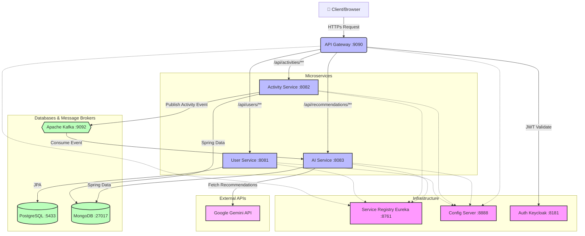

<div align="center">
  <h1>🏃 AI Fitness Microservices 🏋️‍♂️</h1>
  <p><b>A highly scalable, cloud-native, AI-powered fitness tracking and recommendation platform with a beautiful React frontend.</b></p>

  [](https://jdk.java.net/21/)
  [](https://spring.io/projects/spring-boot)
  [](https://spring.io/projects/spring-cloud)
  [](https://react.dev/)
  [](https://vitejs.dev/)
  [](https://mui.com/)
  [](https://www.mongodb.com/)
  [](https://www.postgresql.org/)
  [](https://kafka.apache.org/)
  [](https://www.keycloak.org/)
</div>

<br/>

## 📖 Table of Contents
- [About The Project](#-about-the-project)
- [System Architecture](#-system-architecture)
- [Microservices Ecosystem](#-microservices-ecosystem)
- [Tech Stack](#-tech-stack)
- [Getting Started](#-getting-started)
  - [Prerequisites](#prerequisites)
  - [Infrastructure Setup](#infrastructure-setup)
  - [Backend Setup](#backend-setup)
  - [Frontend Setup](#frontend-setup)
- [Security & Authentication](#-security--authentication)
- [API Endpoints](#-api-endpoints)
- [Frontend Features](#-frontend-features)
- [Troubleshooting](#-troubleshooting)

---

## 🚀 About The Project

**AI Fitness Microservices** is a robust and distributed system designed to handle user activity logging and deliver AI-driven personalized fitness recommendations. The system is built upon a modern **Spring Cloud Microservices Architecture**, implementing patterns like Service Discovery, Centralized Configuration, API Gateways, Event-Driven asynchronous processing via Apache Kafka, and state-of-the-art Generative AI integration using the Google Gemini API.

---

## 🏗️ System Architecture

Our system leverages an advanced microservices topology. Below is a high-level overview of our components and their interactions:



---

## 🧩 Microservices Ecosystem

Our system is decomposed into 6 independent services, each with a distinct bounded context:

| Service Name | Port | Description | Stack / Tech |
|--------------|------|-------------|--------------|
| **`api-gateway`** | `9090` | Single entry point for all client requests. Handles JWT validation, intelligent routing, and user sync filters. | Spring Cloud Gateway, WebFlux, Keycloak JWT |
| **`eureka-server`** | `8761` | Service Registry allowing dynamic discovery of microservices. | Spring Cloud Netflix Eureka |
| **`config-server`** | `8888` | Centralized configuration management serving environment-specific properties to all clients. | Spring Cloud Config (Native profile) |
| **`user-service`** | `8081` | Manages user profiles and domain logic. Connected to a relational store for strict consistency. | PostgreSQL, Spring Data JPA |
| **`activity-service`** | `8082` | Handles user workouts and fitness logs. Publishes events to Kafka when new activities are tracked. | MongoDB, Spring Kafka Producer |
| **`ai-service`** | `8083` | Consumes activity events asynchronously. Uses Google Gemini to generate dynamic, tailored fitness plans. | MongoDB, Kafka Consumer, Spring AI / WebClient |

---

## 🛠 Tech Stack

### Backend
- **Core**: Java 21, Spring Boot 4.0.6, Spring Cloud 2025.1.1
- **Security**: Keycloak (OAuth2.0 / OpenID Connect), Spring Security Resource Server
- **Messaging**: Apache Kafka for scalable, decoupled event-driven architecture
- **Databases**:
  - PostgreSQL (ACID-compliant relational store for Users)
  - MongoDB (Document store for flexible Activity schemas and AI Recommendations)
- **Tooling**: Docker, Maven, Git
- **External Integration**: Google Gemini API

### Frontend
- **Framework**: React 19.2.6 with Vite 8.0.12
- **State Management**: Redux Toolkit 2.12.0
- **UI Library**: Material-UI (MUI) 9.2.0 with Emotion styling
- **HTTP Client**: Axios 1.19.0 with interceptors
- **Authentication**: react-oauth2-code-pkce 1.24.0 (OAuth2 PKCE flow)
- **Routing**: React Router 8.3.0
- **Build Tool**: Vite with HMR (Hot Module Replacement)

---

## ⚙️ Getting Started

### 📋 Prerequisites
- **Java 21 JDK**
- **Node.js 18+** with npm
- **Docker** and **Docker Compose**
- **Maven** (3.8+)
- **Google Gemini API Key** (for `ai-service`)

### 🐳 1. Infrastructure Setup

Spin up the essential infrastructure components using Docker:

```bash
# 1. PostgreSQL (For User Service)
docker run --name ai-fitness-postgres -d \
  -e POSTGRES_PASSWORD=1234 \
  -e POSTGRES_DB=microservice_ai_fitness \
  -p 5433:5432 postgres

# 2. MongoDB (For Activity & AI Services)
docker run --name ai-fitness-mongo -d -p 27017:27017 mongo

# 3. Apache Kafka (Message Broker)
docker run --name ai-fitness-kafka -d -p 9092:9092 \
  -e KAFKA_ADVERTISED_LISTENERS=PLAINTEXT://localhost:9092 \
  -e KAFKA_LISTENER_SECURITY_PROTOCOL_MAP=PLAINTEXT:PLAINTEXT \
  -e KAFKA_INTER_BROKER_LISTENER_NAME=PLAINTEXT \
  confluentinc/cp-kafka

# 4. Keycloak (Authentication Server)
docker run --name ai-fitness-keycloak -d -p 8181:8080 \
  -e KEYCLOAK_ADMIN=admin \
  -e KEYCLOAK_ADMIN_PASSWORD=admin \
  quay.io/keycloak/keycloak:latest start-dev
```

### 🔑 2. Keycloak Realm Configuration
1. Open Keycloak at `http://localhost:8181` and log in as `admin` / `admin`.
2. Create a new realm named **`fitness-app`**.
3. Create a new Client for your frontend/API testing (e.g., `fitness-client` with standard OAuth2 flows).
4. Create test users under this realm to obtain JWTs.

### 🔧 Backend Setup

#### Service Bootstrapping Order

To prevent startup dependency failures, launch the Spring Boot services in the following order:

1. **Config Server** (Port 8888)
   ```bash
   cd backend/Config-Server && ./mvnw spring-boot:run
   ```

2. **Eureka Server** (Port 8761)
   ```bash
   cd backend/eureka-server && ./mvnw spring-boot:run
   ```

3. **User Service** (Port 8081)
   ```bash
   cd backend/user-service && ./mvnw spring-boot:run
   ```

4. **Activity Service** (Port 8082)
   ```bash
   cd backend/activity-service && ./mvnw spring-boot:run
   ```

5. **AI Service** (Port 8083)
   ```bash
   export GEMINI_API_KEY="your-gemini-api-key"
   cd backend/AI-Service && ./mvnw spring-boot:run
   ```

6. **API Gateway** (Port 9090)
   ```bash
   cd backend/api-gateway && ./mvnw spring-boot:run
   ```

> **Important**: Each service must complete startup before starting the next one. Watch for "Started [ServiceName]Application" in logs.

### 🎨 Frontend Setup

1. **Install Dependencies**
   ```bash
   cd frontend/ai-fitness-frontend
   npm install
   ```

2. **Configure Keycloak Client**
   - Open `src/authConfig.js`
   - Verify the Keycloak realm and client match your setup:
     ```javascript
     clientId: "oauth2-pkce-client"
     authorizationEndpoint: "http://localhost:8181/realms/fitness-app/protocol/openid-connect/auth"
     redirectUri: "http://localhost:5173"
     ```

3. **Start Development Server**
   ```bash
   npm run dev
   ```
   - Frontend will be available at `http://localhost:5173`
   - Vite will watch for changes and auto-reload (HMR)

4. **Build for Production**
   ```bash
   npm run build
   npm run preview  # Test production build locally
   ```

---

## 🛡️ Security & Authentication

The entire system is secured behind the **API Gateway**, functioning as an OAuth2 Resource Server. 
The authentication flow works as follows:

1. **User Login**: The client requests an access token from the Keycloak server (`http://localhost:8181/realms/fitness-app/protocol/openid-connect/token`).
2. **Gateway Validation**: The client sends the Bearer JWT token to `api-gateway` (`9090`).
3. **Context Propagation**: The Gateway validates the signature using Keycloak's JWK set, extracts the user ID, and dynamically syncs the user details before routing the request to downstream services like `user-service` or `activity-service`.

---

## 🌐 API Endpoints Overview

All requests should be routed through the `api-gateway` on `http://localhost:9090` and must include the `Authorization: Bearer <token>` header.

### User Service
- `POST /api/users/register` - Register a new user (auto-called by gateway during user sync)
- `GET /api/users/{userId}` - Get user profile
- `GET /api/users/{userId}/validate` - Validate if user exists

### Activity Service
- `POST /api/activities` - Log a new fitness activity
- `GET /api/activities` - Retrieve user's historical fitness logs
- `GET /api/activities/{activityId}` - Get specific activity details

### AI Recommendation Service
- `GET /api/recommendations/user/{userId}` - Fetch AI-generated recommendations for a user
- `POST /api/recommendations` - Create new recommendations (internally called by message listener)

---

## 🎨 Frontend Features

The React frontend provides a beautiful, responsive UI for the fitness tracking system:

### 🔐 Authentication
- **OAuth2 PKCE Flow** with Keycloak integration
- Secure token management with localStorage persistence
- Automatic token refresh and session handling
- Logout with complete session cleanup

### 📊 Activity Tracking
- **Activity Logging Form** with 7 activity types:
  - 🏃 Running, 🚶 Walking, 💓 Cardio
  - 🏋️ Weight Training, 🧘 Yoga, 🏊 Swimming, ⚡ HIIT
- Real-time form validation
- Duration and calories input with emoji indicators

### 📈 Activity Dashboard
- **Activity List** with beautiful card-based UI
- Grid layout (responsive: 1 col mobile, 2 cols tablet, 3 cols desktop)
- Hover animations and smooth transitions
- Empty state messaging
- Loading indicators

### 🤖 AI Recommendations
- **Activity Detail View** showing AI-generated recommendations
- Polling mechanism for recommendation generation (up to 15 retries)
- Sections: Analysis, Improvements, Suggestions, Safety Guidelines

### 🎯 UI/UX Enhancements
- **Material-UI Components** for consistency
- **Gradient AppBar** with user info and logout button
- **Responsive Design** working on all screen sizes
- **Loading States** with spinners and skeleton screens
- **Error Handling** with user-friendly alerts
- **Success Feedback** with toast-like notifications
- **Custom Scrollbar** styling
- **Smooth Animations** and transitions

---

## 🐛 Troubleshooting

### Backend Issues

#### Eureka Registration Fails
**Problem**: Service shows hostname instead of IP in Eureka registry
**Solution**: Always run services via Maven (`./mvnw spring-boot:run`), not IntelliJ. This loads centralized config with `prefer-ip-address: true`.

#### 503 Service Unavailable from Gateway
**Problem**: Gateway can't find service in Eureka
**Solution**: 
1. Verify all services are registered in Eureka at `http://localhost:8761`
2. Ensure Config Server started before other services
3. Check service ports match config (User:8081, Activity:8082, AI:8083, Gateway:9090)

#### 400 Bad Request on Activity Creation
**Problem**: Activity form submission fails with validation errors
**Solution**:
1. Ensure `startTime` is formatted as `YYYY-MM-DDTHH:MM:SS`
2. Verify userId is sent in X-User-ID header (handled by frontend)
3. Check activity type matches enum: RUNNING, WALKING, CARDIO, WEIGHT_TRAINING, YOGA, SWIMMING, HIIT

#### Kafka Connection Refused
**Problem**: Activity Service can't connect to Kafka
**Solution**: Ensure Kafka is running: `docker ps | grep kafka`

### Frontend Issues

#### Blank Login Page / LOGIN Button Not Working
**Problem**: Keycloak OAuth not configured
**Solution**:
1. Verify Keycloak is running at `http://localhost:8181`
2. Create realm `fitness-app`
3. Create client `oauth2-pkce-client` with:
   - Client Authentication: OFF
   - Valid Redirect URIs: `http://localhost:5173`
   - Web Origins: `http://localhost:5173`

#### Vite Dependency Errors
**Problem**: `npm run dev` fails with permission or dependency errors
**Solution**:
```bash
rm -rf node_modules .vite dist
npm cache clean --force
npm install
npm run dev
```

#### CORS Errors in Console
**Problem**: Requests to API Gateway blocked by CORS
**Solution**: API Gateway already has CORS configured for `http://localhost:5173`. Check that gateway is running on port 9090.

#### Logout Doesn't Work
**Problem**: Logout button redirects but session persists on page refresh
**Solution**: 
1. Hard refresh browser (`Ctrl+Shift+R`)
2. Clear browser cache
3. Check that localStorage is properly cleared (DevTools → Application → Local Storage)

### Common Commands

```bash
# Check if service is running
netstat -an | findstr :PORT

# View service logs
tail -f service.log

# Kill process on port
lsof -ti:PORT | xargs kill -9  # macOS/Linux
netstat -ano | findstr :PORT   # Windows

# Clear Docker containers
docker stop $(docker ps -aq)
docker rm $(docker ps -aq)

# Fresh database setup
docker volume prune
docker container prune
```

---

## 📝 Environment Variables

### Backend Services
```bash
# AI Service (required for recommendations)
export GEMINI_API_KEY="your-google-gemini-api-key"

# Optional: Override Eureka location
export EUREKA_SERVER_URL="http://localhost:8761"

# Optional: Override Config Server location
export CONFIG_SERVER_URL="http://localhost:8888"
```

### Frontend
Frontend configuration is in `src/authConfig.js`:
```javascript
{
  clientId: "oauth2-pkce-client",
  authorizationEndpoint: "http://localhost:8181/realms/fitness-app/protocol/openid-connect/auth",
  tokenEndpoint: "http://localhost:8181/realms/fitness-app/protocol/openid-connect/token",
  redirectUri: "http://localhost:5173",
  scope: "openid profile email offline_access"
}
```

---

*Developed with ❤️ using Spring Boot, React, and modern cloud-native technologies.*
