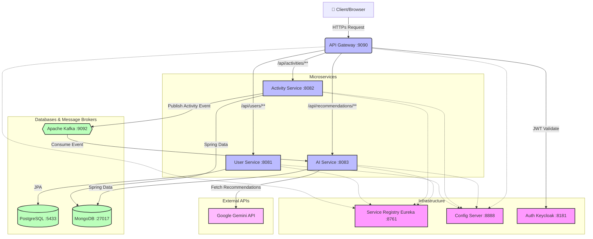

<div align="center">
  <h1>🏃 AI Fitness Microservices 🏋️‍♂️</h1>
  <p><b>A highly scalable, cloud-native, AI-powered fitness tracking and recommendation platform.</b></p>

  [](https://jdk.java.net/21/)
  [](https://spring.io/projects/spring-boot)
  [](https://spring.io/projects/spring-cloud)
  [](https://www.mongodb.com/)
  [](https://www.postgresql.org/)
  [](https://kafka.apache.org/)
  [](https://www.keycloak.org/)
</div>

<br/>

## 📖 Table of Contents
- [About The Project](#-about-the-project)
- [System Architecture](#-system-architecture)
- [Microservices Ecosystem](#-microservices-ecosystem)
- [Tech Stack](#-tech-stack)
- [Getting Started](#-getting-started)
  - [Prerequisites](#prerequisites)
  - [Infrastructure Setup](#infrastructure-setup)
  - [Service Configuration](#service-configuration)
- [Security & Authentication](#-security--authentication)
- [API Endpoints](#-api-endpoints)

---

## 🚀 About The Project

**AI Fitness Microservices** is a robust and distributed system designed to handle user activity logging and deliver AI-driven personalized fitness recommendations. The system is built upon a modern **Spring Cloud Microservices Architecture**, implementing patterns like Service Discovery, Centralized Configuration, API Gateways, Event-Driven asynchronous processing via Apache Kafka, and state-of-the-art Generative AI integration using the Google Gemini API.

---

## 🏗️ System Architecture

Our system leverages an advanced microservices topology. Below is a high-level overview of our components and their interactions:



---

## 🧩 Microservices Ecosystem

Our system is decomposed into 6 independent services, each with a distinct bounded context:

| Service Name | Port | Description | Stack / Tech |
|--------------|------|-------------|--------------|
| **`api-gateway`** | `9090` | Single entry point for all client requests. Handles JWT validation, intelligent routing, and user sync filters. | Spring Cloud Gateway, WebFlux, Keycloak JWT |
| **`eureka-server`** | `8761` | Service Registry allowing dynamic discovery of microservices. | Spring Cloud Netflix Eureka |
| **`config-server`** | `8888` | Centralized configuration management serving environment-specific properties to all clients. | Spring Cloud Config (Native profile) |
| **`user-service`** | `8081` | Manages user profiles and domain logic. Connected to a relational store for strict consistency. | PostgreSQL, Spring Data JPA |
| **`activity-service`** | `8082` | Handles user workouts and fitness logs. Publishes events to Kafka when new activities are tracked. | MongoDB, Spring Kafka Producer |
| **`ai-service`** | `8083` | Consumes activity events asynchronously. Uses Google Gemini to generate dynamic, tailored fitness plans. | MongoDB, Kafka Consumer, Spring AI / WebClient |

---

## 🛠 Tech Stack

- **Core**: Java 21, Spring Boot 4.0.6, Spring Cloud 2025.1.1
- **Security**: Keycloak (OAuth2.0 / OpenID Connect), Spring Security Resource Server
- **Messaging**: Apache Kafka for scalable, decoupled event-driven architecture
- **Databases**:
  - PostgreSQL (ACID-compliant relational store for Users)
  - MongoDB (Document store for flexible Activity schemas and AI Recommendations)
- **Tooling**: Docker, Docker Compose, Maven
- **External Integration**: Google Gemini API

---

## ⚙️ Getting Started

### 📋 Prerequisites
- **Java 21 JDK**
- **Docker** and **Docker Compose**
- **Maven** (3.8+)
- **Google Gemini API Key** (for `ai-service`)

### 🐳 1. Infrastructure Setup

Spin up the essential infrastructure components using Docker:

```bash
# 1. PostgreSQL (For User Service)
docker run --name ai-fitness-postgres -d \
  -e POSTGRES_PASSWORD=1234 \
  -e POSTGRES_DB=microservice_ai_fitness \
  -p 5433:5432 postgres

# 2. MongoDB (For Activity & AI Services)
docker run --name ai-fitness-mongo -d -p 27017:27017 mongo

# 3. Apache Kafka (Message Broker)
docker run --name ai-fitness-kafka -d -p 9092:9092 \
  -e KAFKA_ADVERTISED_LISTENERS=PLAINTEXT://localhost:9092 \
  -e KAFKA_LISTENER_SECURITY_PROTOCOL_MAP=PLAINTEXT:PLAINTEXT \
  -e KAFKA_INTER_BROKER_LISTENER_NAME=PLAINTEXT \
  confluentinc/cp-kafka

# 4. Keycloak (Authentication Server)
docker run --name ai-fitness-keycloak -d -p 8181:8080 \
  -e KEYCLOAK_ADMIN=admin \
  -e KEYCLOAK_ADMIN_PASSWORD=admin \
  quay.io/keycloak/keycloak:latest start-dev
```

### 🔑 2. Keycloak Realm Configuration
1. Open Keycloak at `http://localhost:8181` and log in as `admin` / `admin`.
2. Create a new realm named **`fitness-app`**.
3. Create a new Client for your frontend/API testing (e.g., `fitness-client` with standard OAuth2 flows).
4. Create test users under this realm to obtain JWTs.

### 🏃 3. Service Bootstrapping Order

To prevent startup dependency failures, launch the Spring Boot services in the following order:

1. **`config-server`** (Run `mvn spring-boot:run` in `config-server` directory)
2. **`eureka-server`**
3. **`user-service`** & **`activity-service`**
4. **`ai-service`** 
   > **Note:** Export your Gemini API credentials before starting `ai-service`.
   > ```bash
   > export GEMINI_KEY="your-gemini-api-key"
   > export GEMINI_URL="https://generativelanguage.googleapis.com/v1beta/models/gemini-1.5-flash:generateContent"
   > ```
5. **`api-gateway`**

---

## 🛡️ Security & Authentication

The entire system is secured behind the **API Gateway**, functioning as an OAuth2 Resource Server. 
The authentication flow works as follows:

1. **User Login**: The client requests an access token from the Keycloak server (`http://localhost:8181/realms/fitness-app/protocol/openid-connect/token`).
2. **Gateway Validation**: The client sends the Bearer JWT token to `api-gateway` (`9090`).
3. **Context Propagation**: The Gateway validates the signature using Keycloak's JWK set, extracts the user ID, and dynamically syncs the user details before routing the request to downstream services like `user-service` or `activity-service`.

---

## 🌐 API Endpoints Overview

All requests should be routed through the `api-gateway` on `http://localhost:9090` and must include the `Authorization: Bearer <token>` header.

### User Service
- `GET /api/users/profile` - Fetch current user profile
- `PUT /api/users/profile` - Update user settings

### Activity Service
- `POST /api/activities` - Log a new fitness activity (e.g., Running, Weightlifting)
- `GET /api/activities` - Retrieve user's historical fitness logs

### AI Recommendation Service
- `GET /api/recommendations/latest` - Fetch the most recent AI-generated fitness plan
- `POST /api/recommendations/generate` - Manually trigger a new AI plan generation based on recent Kafka-consumed activities.

---
*Developed with ❤️ and Spring Cloud.*
